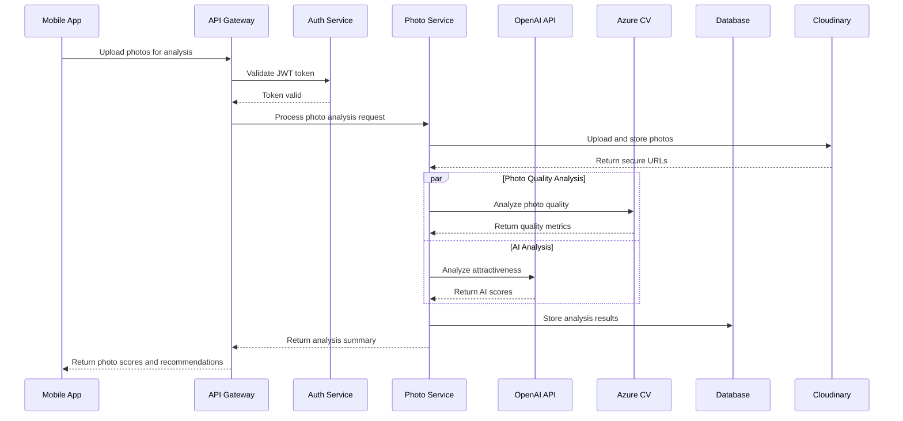
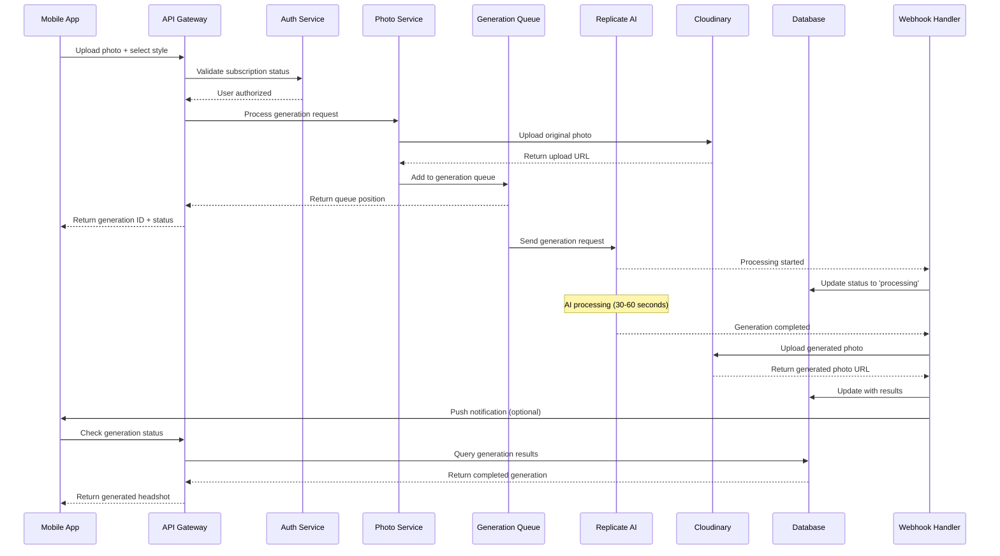

# System Architecture Documentation
## Dating Profile Optimizer & LinkedIn Headshot Generator

This document provides comprehensive architecture documentation for both React Native applications, including system design, component interactions, data flow, and infrastructure architecture.

## 📋 Table of Contents
- [System Overview](#system-overview)
- [Architecture Principles](#architecture-principles)
- [Dating Profile Optimizer Architecture](#dating-profile-optimizer-architecture)
- [LinkedIn Headshot Generator Architecture](#linkedin-headshot-generator-architecture)
- [Shared Infrastructure](#shared-infrastructure)
- [Data Architecture](#data-architecture)
- [Security Architecture](#security-architecture)
- [Integration Architecture](#integration-architecture)
- [Scalability & Performance](#scalability--performance)

## 🎯 System Overview

Both applications follow a modern, cloud-native architecture designed for scalability, maintainability, and security. They share common infrastructure patterns while maintaining service isolation.

### High-Level Architecture Diagram
```
┌─────────────────┐    ┌─────────────────┐
│   Mobile Apps   │    │   Web Demos     │
│  (React Native) │    │    (React)      │
└─────────────────┘    └─────────────────┘
         │                       │
         └───────────┬───────────┘
                     │
              ┌─────────────┐
              │   API GW    │
              │  (Nginx)    │
              └─────────────┘
                     │
        ┌────────────┼────────────┐
        │            │            │
  ┌───────────┐ ┌───────────┐ ┌───────────┐
  │  Dating   │ │ LinkedIn  │ │  Shared   │
  │Optimizer  │ │ Headshot  │ │ Services  │
  │  Backend  │ │  Backend  │ │(DB,Redis) │
  └───────────┘ └───────────┘ └───────────┘
        │            │            │
        └────────────┼────────────┘
                     │
        ┌────────────┼────────────┐
        │            │            │
  ┌───────────┐ ┌───────────┐ ┌───────────┐
  │  OpenAI   │ │ Replicate │ │Cloudinary │
  │    API    │ │    AI     │ │  Storage  │
  └───────────┘ └───────────┘ └───────────┘
```

### Technology Stack Summary
| Component | Dating Profile Optimizer | LinkedIn Headshot Generator |
|-----------|-------------------------|----------------------------|
| **Frontend** | React Native 0.72.6 | React Native 0.80.2 |
| **Backend** | Node.js 18 + Express | Node.js 18 + Express |
| **Database** | PostgreSQL 13 | PostgreSQL 14 |
| **Cache** | Redis 6 | Redis 7 |
| **AI Services** | OpenAI GPT-4, Azure CV | Replicate AI |
| **Payments** | Stripe | RevenueCat + Stripe |
| **Storage** | Cloudinary | Cloudinary |
| **Container** | Docker + Kubernetes | Docker + Kubernetes |

## 🏗️ Architecture Principles

### Core Principles
1. **Microservices Architecture**: Service isolation with clear boundaries
2. **API-First Design**: RESTful APIs with comprehensive documentation
3. **Cloud-Native**: Containerized, scalable, and cloud-agnostic
4. **Security by Design**: Zero-trust security model
5. **Event-Driven**: Asynchronous processing where appropriate
6. **Data Privacy**: GDPR/CCPA compliant data handling
7. **Observability**: Comprehensive monitoring and logging

### Design Patterns
- **Repository Pattern**: Data access abstraction
- **Service Layer Pattern**: Business logic encapsulation
- **Factory Pattern**: Object creation abstraction
- **Observer Pattern**: Event handling and notifications
- **Strategy Pattern**: Algorithm encapsulation (AI models)
- **Circuit Breaker**: Fault tolerance for external services

## 💕 Dating Profile Optimizer Architecture

### System Architecture Diagram
```
┌─────────────────────────────────────────────────────────┐
│                Mobile Application                        │
│  ┌─────────────┐  ┌─────────────┐  ┌─────────────┐     │
│  │   Photo     │  │    Bio      │  │  Analytics  │     │
│  │  Analysis   │  │ Generation  │  │  Dashboard  │     │
│  │  Screen     │  │   Screen    │  │   Screen    │     │
│  └─────────────┘  └─────────────┘  └─────────────┘     │
│           │              │              │               │
│  ┌─────────────┐  ┌─────────────┐  ┌─────────────┐     │
│  │   Camera    │  │  Payment    │  │   Profile   │     │
│  │ Integration │  │  Service    │  │ Management  │     │
│  └─────────────┘  └─────────────┘  └─────────────┘     │
└─────────────────────────────────────────────────────────┘
                              │
                    ┌─────────────────┐
                    │   API Gateway   │
                    │     (Nginx)     │
                    └─────────────────┘
                              │
┌─────────────────────────────────────────────────────────┐
│                Backend Services                         │
│                                                         │
│  ┌─────────────┐  ┌─────────────┐  ┌─────────────┐     │
│  │    Auth     │  │    Photo    │  │     Bio     │     │
│  │  Service    │  │  Analysis   │  │ Generation  │     │
│  │             │  │  Service    │  │  Service    │     │
│  └─────────────┘  └─────────────┘  └─────────────┘     │
│                                                         │
│  ┌─────────────┐  ┌─────────────┐  ┌─────────────┐     │
│  │  Payment    │  │ Analytics   │  │   Dating    │     │
│  │  Service    │  │  Service    │  │ Psychology  │     │
│  │             │  │             │  │  Service    │     │
│  └─────────────┘  └─────────────┘  └─────────────┘     │
└─────────────────────────────────────────────────────────┘
                              │
┌─────────────────────────────────────────────────────────┐
│                 Data Layer                              │
│                                                         │
│  ┌─────────────┐  ┌─────────────┐  ┌─────────────┐     │
│  │ PostgreSQL  │  │    Redis    │  │ Cloudinary  │     │
│  │  Database   │  │    Cache    │  │   Storage   │     │
│  └─────────────┘  └─────────────┘  └─────────────┘     │
└─────────────────────────────────────────────────────────┘
                              │
┌─────────────────────────────────────────────────────────┐
│              External Services                          │
│                                                         │
│  ┌─────────────┐  ┌─────────────┐  ┌─────────────┐     │
│  │   OpenAI    │  │   Azure     │  │    Stripe   │     │
│  │   GPT-4     │  │ Computer    │  │   Payment   │     │
│  │     API     │  │   Vision    │  │  Processing │     │
│  └─────────────┘  └─────────────┘  └─────────────┘     │
│                                                         │
│  ┌─────────────┐  ┌─────────────┐  ┌─────────────┐     │
│  │  Mixpanel   │  │ Amplitude   │  │   SendGrid  │     │
│  │ Analytics   │  │ Analytics   │  │    Email    │     │
│  └─────────────┘  └─────────────┘  └─────────────┘     │
└─────────────────────────────────────────────────────────┘
```

### Component Interactions - Photo Analysis Flow


### Database Schema - Dating Profile Optimizer
```sql
-- Users table
CREATE TABLE users (
    id UUID PRIMARY KEY DEFAULT gen_random_uuid(),
    email_encrypted TEXT UNIQUE NOT NULL,
    password_hash TEXT NOT NULL,
    name_encrypted TEXT,
    age INTEGER,
    gender TEXT,
    dating_preferences JSONB,
    subscription_tier TEXT DEFAULT 'free',
    credits_remaining INTEGER DEFAULT 1,
    created_at TIMESTAMP DEFAULT NOW(),
    updated_at TIMESTAMP DEFAULT NOW()
);

-- Photo analyses table
CREATE TABLE photo_analyses (
    id UUID PRIMARY KEY DEFAULT gen_random_uuid(),
    user_id UUID REFERENCES users(id) ON DELETE CASCADE,
    photo_url TEXT NOT NULL,
    overall_score INTEGER,
    detailed_scores JSONB,
    platform_optimization JSONB,
    improvement_suggestions JSONB,
    ai_insights JSONB,
    analysis_status TEXT DEFAULT 'pending',
    created_at TIMESTAMP DEFAULT NOW(),
    expires_at TIMESTAMP DEFAULT NOW() + INTERVAL '30 days'
);

-- Generated bios table
CREATE TABLE generated_bios (
    id UUID PRIMARY KEY DEFAULT gen_random_uuid(),
    user_id UUID REFERENCES users(id) ON DELETE CASCADE,
    bio_text TEXT NOT NULL,
    bio_style TEXT NOT NULL,
    platform TEXT NOT NULL,
    psychology_analysis JSONB,
    performance_metrics JSONB,
    a_b_test_data JSONB,
    created_at TIMESTAMP DEFAULT NOW()
);

-- Success metrics table
CREATE TABLE success_metrics (
    id UUID PRIMARY KEY DEFAULT gen_random_uuid(),
    user_id UUID REFERENCES users(id) ON DELETE CASCADE,
    platform TEXT NOT NULL,
    matches_count INTEGER DEFAULT 0,
    conversations_count INTEGER DEFAULT 0,
    dates_count INTEGER DEFAULT 0,
    period_start DATE,
    period_end DATE,
    profile_version TEXT,
    photo_set_id UUID,
    bio_id UUID,
    recorded_at TIMESTAMP DEFAULT NOW()
);

-- Purchases table
CREATE TABLE purchases (
    id UUID PRIMARY KEY DEFAULT gen_random_uuid(),
    user_id UUID REFERENCES users(id) ON DELETE CASCADE,
    stripe_payment_intent_id TEXT UNIQUE,
    amount_cents INTEGER NOT NULL,
    currency TEXT DEFAULT 'USD',
    credits_purchased INTEGER NOT NULL,
    purchase_status TEXT DEFAULT 'pending',
    created_at TIMESTAMP DEFAULT NOW()
);

-- Analytics events table
CREATE TABLE analytics_events (
    id UUID PRIMARY KEY DEFAULT gen_random_uuid(),
    user_id UUID,
    event_type TEXT NOT NULL,
    event_properties JSONB,
    session_id TEXT,
    created_at TIMESTAMP DEFAULT NOW()
);
```

### Security Implementation - Dating Optimizer
```typescript
// Multi-layered security architecture
interface SecurityLayers {
  authentication: {
    jwt: JWTConfig;
    biometric: BiometricAuth;
    mfa: MFAConfig;
  };
  authorization: {
    rbac: RoleBasedAccess;
    permissions: PermissionMatrix;
  };
  dataProtection: {
    encryption: EncryptionService;
    masking: DataMasking;
    retention: DataRetention;
  };
  networkSecurity: {
    tlsConfig: TLSConfiguration;
    certificatePinning: CertificatePinning;
    rateLimiting: RateLimiter;
  };
}

// Security middleware stack
const securityMiddleware = [
  helmet(), // Security headers
  rateLimit(), // Rate limiting
  authenticate(), // JWT validation
  authorize(), // Permission check
  validateInput(), // Input sanitization
  auditLog() // Security logging
];
```

## 📸 LinkedIn Headshot Generator Architecture

### System Architecture Diagram
```
┌─────────────────────────────────────────────────────────┐
│              Mobile Application (iOS-First)             │
│  ┌─────────────┐  ┌─────────────┐  ┌─────────────┐     │
│  │   Photo     │  │   Style     │  │ Generation  │     │
│  │  Capture    │  │ Selection   │  │  Progress   │     │
│  │  Screen     │  │   Screen    │  │   Screen    │     │
│  └─────────────┘  └─────────────┘  └─────────────┘     │
│           │              │              │               │
│  ┌─────────────┐  ┌─────────────┐  ┌─────────────┐     │
│  │   Results   │  │  Payment    │  │    Demo     │     │
│  │  Gallery    │  │  Service    │  │  Interface  │     │
│  └─────────────┘  └─────────────┘  └─────────────┘     │
└─────────────────────────────────────────────────────────┘
                              │
                    ┌─────────────────┐
                    │   API Gateway   │
                    │     (Nginx)     │
                    └─────────────────┘
                              │
┌─────────────────────────────────────────────────────────┐
│                Backend Services                         │
│                                                         │
│  ┌─────────────┐  ┌─────────────┐  ┌─────────────┐     │
│  │    Auth     │  │   Photo     │  │   Style     │     │
│  │  Service    │  │ Processing  │  │ Template    │     │
│  │             │  │  Service    │  │  Service    │     │
│  └─────────────┘  └─────────────┘  └─────────────┘     │
│                                                         │
│  ┌─────────────┐  ┌─────────────┐  ┌─────────────┐     │
│  │ Generation  │  │  Payment    │  │ Analytics   │     │
│  │   Queue     │  │  Service    │  │  Service    │     │
│  │  Service    │  │ (RevenueCat)│  │             │     │
│  └─────────────┘  └─────────────┘  └─────────────┘     │
└─────────────────────────────────────────────────────────┘
                              │
┌─────────────────────────────────────────────────────────┐
│                 Data Layer                              │
│                                                         │
│  ┌─────────────┐  ┌─────────────┐  ┌─────────────┐     │
│  │ PostgreSQL  │  │    Redis    │  │ Cloudinary  │     │
│  │  Database   │  │   Cache     │  │   CDN       │     │
│  └─────────────┘  └─────────────┘  └─────────────┘     │
└─────────────────────────────────────────────────────────┘
                              │
┌─────────────────────────────────────────────────────────┐
│              External Services                          │
│                                                         │
│  ┌─────────────┐  ┌─────────────┐  ┌─────────────┐     │
│  │ Replicate   │  │ RevenueCat  │  │   Stripe    │     │
│  │   AI API    │  │ Subscription│  │   Backup    │     │
│  │             │  │ Management  │  │  Payment    │     │
│  └─────────────┘  └─────────────┘  └─────────────┘     │
│                                                         │
│  ┌─────────────┐  ┌─────────────┐  ┌─────────────┐     │
│  │  Mixpanel   │  │   SendGrid  │  │ Apple Push  │     │
│  │ Analytics   │  │    Email    │  │Notifications│     │
│  └─────────────┘  └─────────────┘  └─────────────┘     │
└─────────────────────────────────────────────────────────┘
```

### AI Processing Flow - Headshot Generation


### Database Schema - LinkedIn Headshot Generator
```sql
-- Users table
CREATE TABLE users (
    id UUID PRIMARY KEY DEFAULT gen_random_uuid(),
    email TEXT UNIQUE NOT NULL,
    name TEXT,
    subscription_status TEXT DEFAULT 'free',
    subscription_expires_at TIMESTAMP,
    credits_remaining TEXT DEFAULT '1', -- Can be 'unlimited'
    total_generations INTEGER DEFAULT 0,
    created_at TIMESTAMP DEFAULT NOW(),
    updated_at TIMESTAMP DEFAULT NOW()
);

-- Style templates table
CREATE TABLE style_templates (
    id TEXT PRIMARY KEY,
    name TEXT NOT NULL,
    description TEXT,
    preview_url TEXT,
    industry_focus TEXT[],
    formality_level TEXT,
    subscription_required BOOLEAN DEFAULT FALSE,
    sort_order INTEGER DEFAULT 0,
    is_active BOOLEAN DEFAULT TRUE
);

-- Photo generations table
CREATE TABLE photo_generations (
    id UUID PRIMARY KEY DEFAULT gen_random_uuid(),
    user_id UUID REFERENCES users(id) ON DELETE CASCADE,
    original_photo_url TEXT NOT NULL,
    style_id TEXT REFERENCES style_templates(id),
    generation_status TEXT DEFAULT 'pending',
    generated_photo_url TEXT,
    thumbnail_url TEXT,
    processing_started_at TIMESTAMP,
    processing_completed_at TIMESTAMP,
    ai_confidence_score INTEGER,
    quality_metrics JSONB,
    created_at TIMESTAMP DEFAULT NOW(),
    expires_at TIMESTAMP DEFAULT NOW() + INTERVAL '30 days'
);

-- Purchases table
CREATE TABLE purchases (
    id UUID PRIMARY KEY DEFAULT gen_random_uuid(),
    user_id UUID REFERENCES users(id) ON DELETE CASCADE,
    revenuecat_transaction_id TEXT UNIQUE,
    product_id TEXT NOT NULL,
    purchase_date TIMESTAMP NOT NULL,
    credits_added TEXT, -- Can be 'unlimited'
    purchase_status TEXT DEFAULT 'active',
    created_at TIMESTAMP DEFAULT NOW()
);

-- Analytics events table
CREATE TABLE analytics_events (
    id UUID PRIMARY KEY DEFAULT gen_random_uuid(),
    user_id UUID,
    event_type TEXT NOT NULL,
    event_properties JSONB,
    session_id TEXT,
    platform TEXT,
    created_at TIMESTAMP DEFAULT NOW()
);
```

### Payment Architecture - RevenueCat Integration
```typescript
// Payment service architecture
class PaymentArchitecture {
  constructor(
    private revenuecat: RevenueCatService,
    private stripe: StripeService,
    private database: DatabaseService
  ) {}

  async processSubscription(userId: string, purchaseData: PurchaseData) {
    // 1. Validate purchase with RevenueCat
    const validation = await this.revenuecat.validatePurchase(purchaseData);
    
    // 2. Update user subscription status
    await this.database.updateUserSubscription(userId, {
      status: validation.subscription_status,
      expires_at: validation.expires_date,
      credits: validation.product_type === 'unlimited' ? 'unlimited' : validation.credits
    });
    
    // 3. Record purchase in database
    await this.database.recordPurchase({
      user_id: userId,
      transaction_id: validation.transaction_id,
      product_id: validation.product_identifier,
      purchase_date: validation.purchase_date
    });
    
    // 4. Trigger analytics event
    await this.analytics.track('subscription_activated', {
      user_id: userId,
      product_id: validation.product_identifier,
      revenue: validation.price
    });
  }
}
```

## 🏢 Shared Infrastructure

### Containerization Strategy
```dockerfile
# Multi-stage build pattern for both applications
FROM node:18-alpine AS base
WORKDIR /app
RUN apk add --no-cache dumb-init

FROM base AS dependencies
COPY package*.json ./
RUN npm ci --only=production

FROM base AS build
COPY . .
COPY --from=dependencies /app/node_modules ./node_modules
RUN npm run build

FROM base AS runtime
ENV NODE_ENV=production
COPY --from=dependencies /app/node_modules ./node_modules
COPY --from=build /app/dist ./dist
USER 1001
ENTRYPOINT ["dumb-init", "--"]
CMD ["node", "dist/app.js"]
```

### Kubernetes Deployment Architecture
```yaml
# Shared resource template
apiVersion: v1
kind: Namespace
metadata:
  name: shared-services
---
# PostgreSQL StatefulSet with read replicas
apiVersion: apps/v1
kind: StatefulSet
metadata:
  name: postgres-primary
  namespace: shared-services
spec:
  serviceName: postgres-primary
  replicas: 1
  template:
    spec:
      containers:
      - name: postgres
        image: postgres:14-alpine
        env:
        - name: POSTGRES_REPLICATION_MODE
          value: master
        - name: POSTGRES_REPLICATION_USER
          value: replicator
---
# Read replica configuration
apiVersion: apps/v1
kind: StatefulSet
metadata:
  name: postgres-replica
  namespace: shared-services
spec:
  serviceName: postgres-replica
  replicas: 2
  template:
    spec:
      containers:
      - name: postgres
        image: postgres:14-alpine
        env:
        - name: POSTGRES_REPLICATION_MODE
          value: slave
        - name: POSTGRES_MASTER_SERVICE
          value: postgres-primary
```

### Service Mesh Architecture (Istio)
```yaml
# Service mesh configuration
apiVersion: networking.istio.io/v1alpha3
kind: VirtualService
metadata:
  name: dating-optimizer-vs
spec:
  hosts:
  - api.datingoptimizer.com
  gateways:
  - dating-optimizer-gateway
  http:
  - match:
    - uri:
        prefix: /api/v1/
    route:
    - destination:
        host: dating-optimizer-service
        port:
          number: 80
    retries:
      attempts: 3
      perTryTimeout: 30s
    timeout: 60s
```

### Monitoring Architecture
```yaml
# Prometheus monitoring configuration
apiVersion: v1
kind: ConfigMap
metadata:
  name: prometheus-config
data:
  prometheus.yml: |
    global:
      scrape_interval: 15s
    scrape_configs:
    - job_name: 'dating-optimizer'
      kubernetes_sd_configs:
      - role: endpoints
        namespaces:
          names: [dating-optimizer]
    - job_name: 'linkedin-headshot'
      kubernetes_sd_configs:
      - role: endpoints
        namespaces:
          names: [linkedin-headshot]
    alerting:
      alertmanagers:
      - static_configs:
        - targets: [alertmanager:9093]
```

## 📊 Data Architecture

### Data Flow Architecture
```
┌─────────────────┐    ┌─────────────────┐    ┌─────────────────┐
│   Operational   │    │   Analytical    │    │    Archive      │
│   Database      │───▶│   Database      │───▶│   Storage       │
│  (PostgreSQL)   │    │   (Data Lake)   │    │   (S3/GCS)      │
└─────────────────┘    └─────────────────┘    └─────────────────┘
         │                       │                       │
         ▼                       ▼                       ▼
┌─────────────────┐    ┌─────────────────┐    ┌─────────────────┐
│    Real-time    │    │   Batch ETL     │    │   Long-term     │
│   Processing    │    │  Processing     │    │   Storage       │
│   (Redis)       │    │  (Airflow)      │    │  (Glacier)      │
└─────────────────┘    └─────────────────┘    └─────────────────┘
```

### Data Modeling Strategy
```typescript
// Domain-driven design entities
interface DatingOptimizerDomain {
  user: UserEntity;
  photoAnalysis: PhotoAnalysisEntity;
  bioGeneration: BioGenerationEntity;
  successMetrics: SuccessMetricsEntity;
  purchase: PurchaseEntity;
}

interface LinkedInHeadshotDomain {
  user: UserEntity;
  styleTemplate: StyleTemplateEntity;
  photoGeneration: PhotoGenerationEntity;
  subscription: SubscriptionEntity;
  analytics: AnalyticsEntity;
}

// Shared value objects
interface SharedValueObjects {
  userId: UUID;
  photoUrl: SecureURL;
  encryptedData: EncryptedValue;
  timestamp: ISODateTime;
  money: MoneyValue;
}
```

### Caching Strategy
```typescript
// Multi-layer caching architecture
interface CacheArchitecture {
  l1Cache: {
    type: 'memory';
    ttl: '5 minutes';
    usage: 'frequently accessed data';
  };
  l2Cache: {
    type: 'redis';
    ttl: '1 hour';
    usage: 'session data, API responses';
  };
  l3Cache: {
    type: 'cdn';
    ttl: '24 hours';
    usage: 'static assets, images';
  };
}

// Cache invalidation strategy
class CacheInvalidationService {
  async invalidateUserData(userId: string): Promise<void> {
    await Promise.all([
      this.l1Cache.delete(`user:${userId}`),
      this.l2Cache.delete(`user:${userId}:*`),
      this.cdn.purge(`/users/${userId}/*`)
    ]);
  }
}
```

## 🔐 Security Architecture

### Zero Trust Security Model
```
┌─────────────────┐    ┌─────────────────┐    ┌─────────────────┐
│   Identity &    │    │   Network       │    │   Application   │
│   Access        │    │   Security      │    │   Security      │
│   Management    │    │                 │    │                 │
├─────────────────┤    ├─────────────────┤    ├─────────────────┤
│ • JWT Tokens    │    │ • mTLS          │    │ • Input Valid   │
│ • Biometric     │    │ • Network Segm  │    │ • Output Encod  │
│ • MFA           │    │ • Firewall      │    │ • CSRF Protect  │
│ • RBAC          │    │ • DDoS Protect  │    │ • XSS Prevent   │
└─────────────────┘    └─────────────────┘    └─────────────────┘
         │                       │                       │
         └───────────┬───────────┴───────────┬───────────┘
                     │                       │
                     ▼                       ▼
            ┌─────────────────┐    ┌─────────────────┐
            │   Data          │    │   Infrastructure│
            │   Protection    │    │   Security      │
            ├─────────────────┤    ├─────────────────┤
            │ • Encryption    │    │ • Container Sec │
            │ • Key Mgmt      │    │ • K8s Policies  │
            │ • Data Masking  │    │ • Image Scanning│
            │ • Backup Sec    │    │ • Compliance    │
            └─────────────────┘    └─────────────────┘
```

### Security Control Matrix
| Control Category | Dating Profile Optimizer | LinkedIn Headshot Generator |
|-----------------|---------------------------|----------------------------|
| **Authentication** | JWT + Biometric + MFA | JWT + Biometric |
| **Authorization** | RBAC + Permissions | Subscription-based |
| **Data Encryption** | AES-256 at rest/transit | AES-256 at rest/transit |
| **Photo Security** | Auto-delete + Watermark | Auto-delete + Access Control |
| **API Security** | Rate limiting + Validation | Rate limiting + Validation |
| **Compliance** | GDPR + CCPA + SOC2 | GDPR + CCPA |

## 🔗 Integration Architecture

### External Service Integration
```typescript
// Circuit breaker pattern for external services
class ExternalServiceIntegration {
  constructor(
    private circuitBreaker: CircuitBreaker,
    private retryPolicy: RetryPolicy,
    private timeoutPolicy: TimeoutPolicy
  ) {}

  async callOpenAI(prompt: string): Promise<AIResponse> {
    return await this.circuitBreaker.execute(async () => {
      return await this.retryPolicy.execute(async () => {
        return await this.timeoutPolicy.execute(async () => {
          return await this.openaiClient.createCompletion(prompt);
        });
      });
    });
  }
}

// Integration resilience patterns
interface ResiliencePatterns {
  circuitBreaker: {
    failureThreshold: 5;
    recoveryTimeout: 30000;
    monitoringPeriod: 60000;
  };
  retry: {
    maxAttempts: 3;
    backoffStrategy: 'exponential';
    baseDelay: 1000;
  };
  timeout: {
    requestTimeout: 30000;
    connectionTimeout: 5000;
  };
}
```

### Event-Driven Architecture
```typescript
// Event sourcing and CQRS pattern
interface EventArchitecture {
  events: {
    UserRegistered: UserRegisteredEvent;
    PhotoAnalysisCompleted: PhotoAnalysisCompletedEvent;
    BiocGenerationStarted: BioGenerationStartedEvent;
    PaymentProcessed: PaymentProcessedEvent;
    SubscriptionActivated: SubscriptionActivatedEvent;
  };
  
  eventStore: EventStore;
  eventBus: EventBus;
  commandHandlers: CommandHandler[];
  queryHandlers: QueryHandler[];
  projections: ReadModelProjection[];
}

// Event handling example
class PhotoAnalysisEventHandler {
  async handle(event: PhotoAnalysisCompletedEvent): Promise<void> {
    // Update read model
    await this.updatePhotoAnalysisProjection(event);
    
    // Trigger notifications
    await this.notificationService.sendAnalysisComplete(event.userId);
    
    // Update analytics
    await this.analyticsService.trackPhotoAnalysis(event);
    
    // Trigger next steps
    if (event.shouldTriggerBioGeneration) {
      await this.commandBus.send(new GenerateBioCommand(event.userId));
    }
  }
}
```

## ⚡ Scalability & Performance

### Horizontal Scaling Architecture
```
                    ┌─────────────────┐
                    │   Load Balancer │
                    │    (HAProxy)    │
                    └─────────────────┘
                             │
        ┌────────────────────┼────────────────────┐
        │                   │                    │
┌─────────────┐     ┌─────────────┐     ┌─────────────┐
│  App Server │     │  App Server │     │  App Server │
│    Node 1   │     │    Node 2   │     │    Node 3   │
└─────────────┘     └─────────────┘     └─────────────┘
        │                   │                    │
        └────────────────────┼────────────────────┘
                             │
        ┌────────────────────┼────────────────────┐
        │                   │                    │
┌─────────────┐     ┌─────────────┐     ┌─────────────┐
│  Database   │     │    Redis    │     │  File Store │
│  Primary    │     │   Cluster   │     │    (CDN)    │
└─────────────┘     └─────────────┘     └─────────────┘
        │
┌─────────────┐
│  Database   │
│   Replica   │
└─────────────┘
```

### Performance Optimization Strategies
```typescript
// Performance monitoring and optimization
interface PerformanceArchitecture {
  caching: {
    strategy: 'multi-layer';
    levels: ['memory', 'redis', 'cdn'];
    invalidation: 'event-driven';
  };
  
  database: {
    optimization: ['indexing', 'query-optimization', 'connection-pooling'];
    scaling: ['read-replicas', 'sharding', 'partitioning'];
    monitoring: ['slow-query-log', 'performance-schema'];
  };
  
  api: {
    optimization: ['response-compression', 'api-versioning', 'pagination'];
    monitoring: ['response-time', 'throughput', 'error-rate'];
    limits: ['rate-limiting', 'payload-size', 'timeout'];
  };
  
  mobile: {
    optimization: ['image-compression', 'lazy-loading', 'offline-caching'];
    monitoring: ['crash-reporting', 'performance-tracking', 'user-analytics'];
    features: ['progressive-loading', 'background-sync', 'push-notifications'];
  };
}

// Auto-scaling configuration
class AutoScalingService {
  private readonly scalingRules = {
    cpu: { threshold: 70, scaleUp: 2, scaleDown: 1 },
    memory: { threshold: 80, scaleUp: 2, scaleDown: 1 },
    requests: { threshold: 1000, scaleUp: 3, scaleDown: 1 }
  };

  async evaluateScaling(): Promise<ScalingDecision> {
    const metrics = await this.getMetrics();
    
    if (this.shouldScaleUp(metrics)) {
      return { action: 'scale-up', factor: this.calculateScaleFactor(metrics) };
    }
    
    if (this.shouldScaleDown(metrics)) {
      return { action: 'scale-down', factor: 1 };
    }
    
    return { action: 'maintain', factor: 1 };
  }
}
```

### Disaster Recovery Architecture
```typescript
// Multi-region disaster recovery
interface DisasterRecoveryArchitecture {
  primary: {
    region: 'us-west-2';
    database: 'primary-cluster';
    storage: 'primary-bucket';
    compute: 'primary-k8s-cluster';
  };
  
  secondary: {
    region: 'us-east-1';
    database: 'replica-cluster';
    storage: 'replica-bucket';
    compute: 'standby-k8s-cluster';
  };
  
  failover: {
    rto: '15 minutes'; // Recovery Time Objective
    rpo: '1 minute'; // Recovery Point Objective
    trigger: 'automatic';
    monitoring: 'cross-region-health-checks';
  };
  
  backup: {
    frequency: 'continuous';
    retention: '90 days';
    testing: 'monthly';
    verification: 'automated';
  };
}
```

## 📊 Quality Attributes

### Reliability Measures
- **Availability**: 99.9% uptime SLA
- **MTBF**: Mean Time Between Failures > 720 hours
- **MTTR**: Mean Time To Recovery < 15 minutes
- **Error Rate**: < 0.1% for critical operations

### Performance Targets
- **API Response Time**: < 200ms for 95th percentile
- **Database Query Time**: < 50ms average
- **Mobile App Launch Time**: < 3 seconds
- **Image Processing Time**: < 60 seconds for AI operations

### Security Metrics
- **Authentication Failure Rate**: < 1%
- **Data Breach Incidents**: 0 tolerance
- **Vulnerability Patch Time**: < 24 hours for critical
- **Compliance Score**: 100% for GDPR/CCPA

## 📞 Architecture Governance

### Architecture Review Board
- **Solution Architect**: Architecture decisions and standards
- **Security Architect**: Security requirements and compliance
- **Performance Engineer**: Scalability and performance optimization
- **DevOps Lead**: Infrastructure and deployment strategies

### Architecture Documentation Standards
- **C4 Model**: Context, Containers, Components, Code
- **ADR Format**: Architecture Decision Records
- **Review Process**: Quarterly architecture reviews
- **Update Frequency**: Monthly documentation updates

---

**Document Version**: 1.0  
**Last Updated**: February 1, 2024  
**Next Review**: March 1, 2024  
**Approved By**: Architecture Review Board

This architecture documentation provides a comprehensive overview of both applications' technical design, ensuring scalability, maintainability, and security for production deployment.